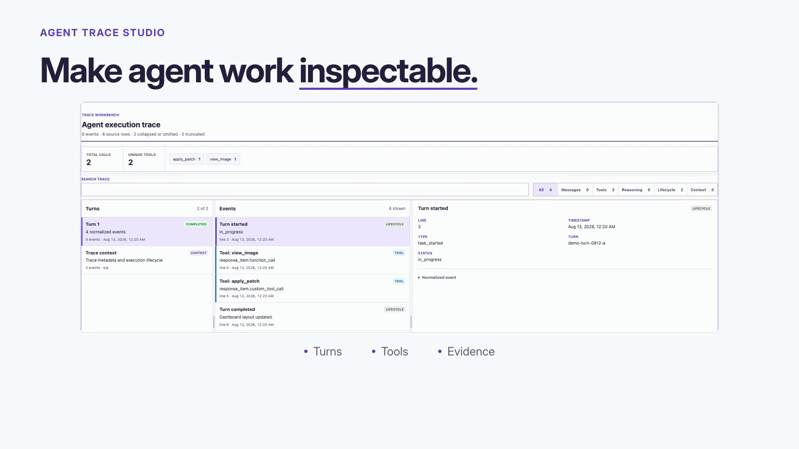

# Agent Trace Studio product tour

[Watch the MP4 with sound](media/agent-trace-studio-demo.mp4) ·
[Silent looping GIF](media/agent-trace-studio-demo.gif) ·
[Four-chapter contact sheet](media/contact-sheet.jpg)

A 30-second, 1920 × 1080 tour with AI-generated narration and subtle
instrumental music. Open the MP4 and enable your player's sound to hear it;
the GIF is silent.

The tour shows how to load a trace, inspect tool calls, and find the agent/API
controls. All examples are synthetic. The final chapter is a labeled control
illustration, not a live model request.

See [credits and licensing notices](CREDITS.md).
