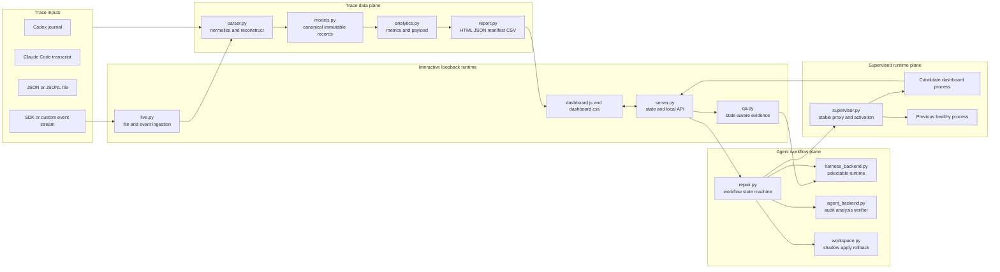
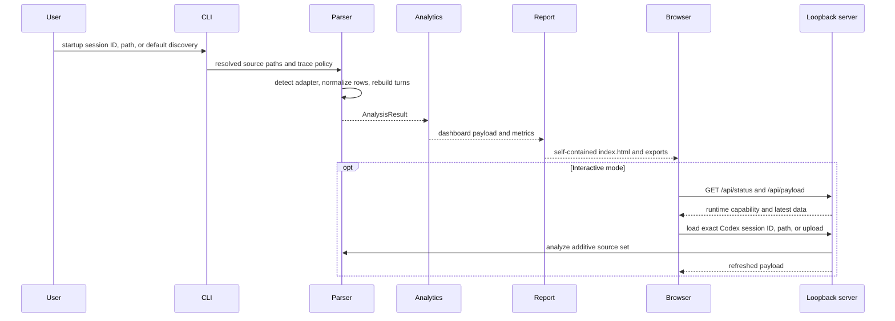
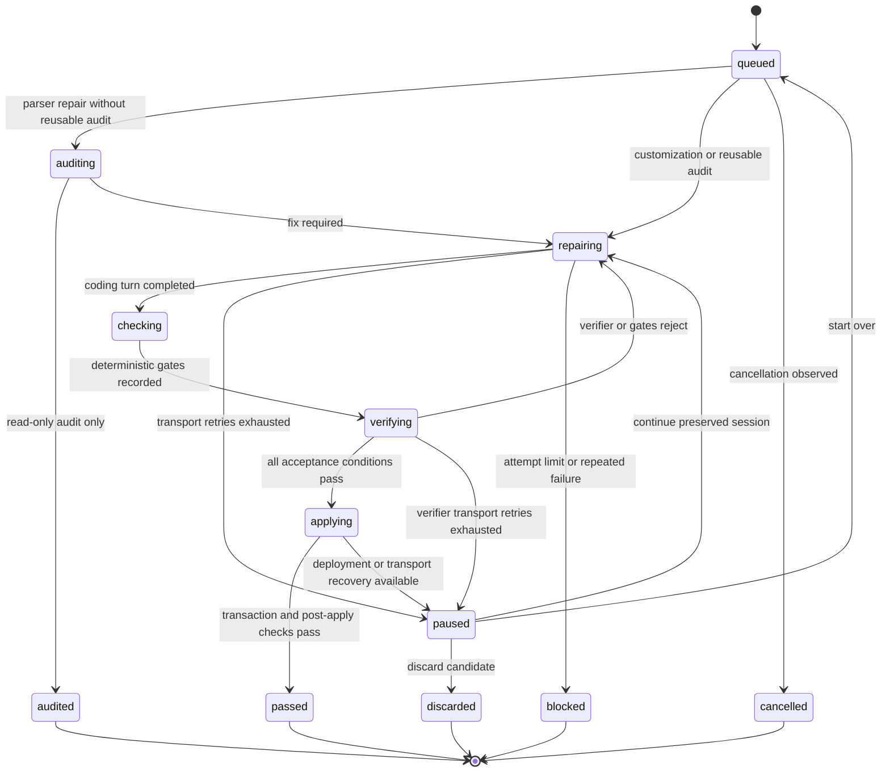
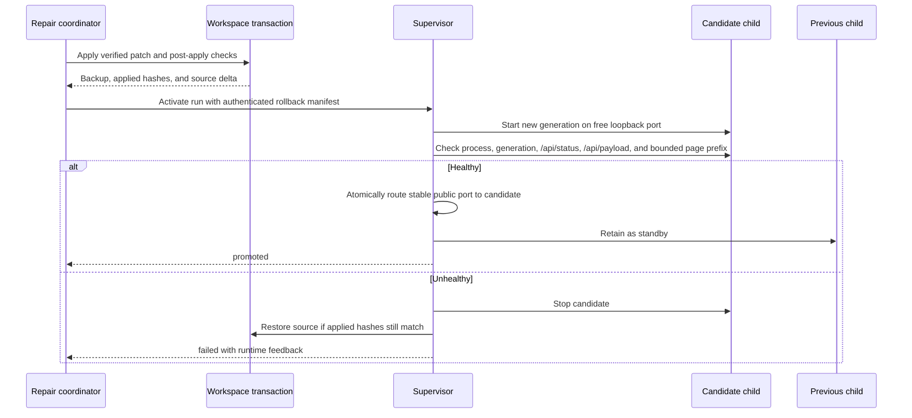

# Agent Trace Studio: Product And System Design

- Status: current implementation with explicitly marked proposed changes
- Product version: 0.9.x
- Last reviewed: 2026-08-28
- Implementation assurance: partial; see Section 26 for reviewed gaps

## 1. Summary

Agent Trace Studio is a local-first workbench for understanding, questioning,
and improving agent executions. It accepts native Codex and Claude Code
journals, plus a provider-neutral stream for SDK and custom agents. It
normalizes those inputs into sessions, turns, events, tool calls, usage, and
data-quality records, then presents them in a directly openable HTML dashboard.

The interactive loopback server adds four capabilities to the static report:

1. Load traces by exact Codex session ID, path, or upload.
2. Ask state-aware questions about the selected source, turn, event,
   checkpoint, contract, or highlighted text.
3. Run explicit investigation, memory extraction, session-brief, parser audit,
   parser repair, and dashboard customization workflows.
4. Follow growing files or framework-published events and activate verified
   local source changes through an optional supervisor.

The product is intentionally local. It is not a hosted observability service,
an agent execution runtime, or a replacement for framework-native telemetry.
Its differentiator is the combination of readable execution reconstruction,
selection-aware analysis, and a guarded repair loop that can improve the local
Studio checkout without giving journal content authority over source changes.

## 2. Goals

- Reconstruct what an agent did, in chronological and turn-oriented form.
- Make messages, reasoning markers, lifecycle events, and tool calls easy to
  inspect without reading raw JSONL.
- Preserve exact turn and source-line anchors so findings can be checked.
- Keep the current dashboard selection authoritative for every agent question.
- Maintain a persisted session-wide brief that can append live revisions without
  losing completed checkpoints.
- Support native journals and agents that only expose event streams.
- Keep read-only reports usable without a running server or network resources.
- Allow local parser repair and dashboard customization only through an
  isolated, verified, transactional workflow.
- Work consistently on macOS, Linux, and Windows.
- Make truncation, malformed input, omitted data, and unavailable capabilities
  visible rather than silently inventing or dropping meaning.

## 3. Non-Goals

- Hosting traces for multiple users or exposing the server beyond loopback.
- Executing or steering the observed agent without an explicit operator action,
  or intercepting its tool calls.
- Recovering encrypted reasoning or reconstructing content absent from input.
- Treating model-generated checkpoints, memories, or investigations as facts
  without trace evidence.
- Automatically publishing extracted memories into another memory system.
- Automatically changing source because trace content asks for a change.
- Guaranteeing that a passing model verifier proves semantic correctness.
- Replacing LangSmith, Langfuse, Phoenix, OpenTelemetry, or framework-specific
  production telemetry pipelines.

## 4. Users And Core Jobs

| User | Job | Successful outcome |
| --- | --- | --- |
| Agent developer | Debug one failed or surprising run | Finds the exact turn and event where behavior diverged |
| Framework developer | Validate an adapter or parser | Sees normalized coverage, omissions, and malformed records |
| Evaluator | Compare process with final outcome | Connects claims and checkpoints to exact evidence anchors |
| Local tool author | Customize Studio for a workflow | Produces a verified local patch without manual branching |
| Operator | Follow an active run | Receives new events without losing a deliberate selection |
| Researcher | Extract reusable lessons | Gets evidence-backed memory candidates instead of a transcript summary |

## 5. Design Principles

1. **Local first.** Static inspection works from disk; interactive features bind
   only to `127.0.0.1`.
2. **Evidence before narrative.** Agent outputs cite normalized turn and line
   anchors. Previous answers are conversation, not evidence.
3. **State is explicit.** Each question carries an immutable snapshot of the
   current source, turn, event, focus, and filters.
4. **Trace content is untrusted.** Journal text can inform an answer but cannot
   authorize a workflow, a source write, or a deployment.
5. **Models propose; code enforces.** Typed actions, path boundaries, size
   limits, deterministic checks, hash conflicts, and rollback are host-owned.
   This is a target invariant; Section 26 records current enforcement gaps.
6. **One logical fixer session.** Verification feedback returns to the same
   coding session and candidate workspace across attempts.
7. **Failure is inspectable.** Activity, attempts, check output, verifier
   findings, recovery choices, and deployment results persist across refreshes.
8. **Adapters normalize at the edge.** The UI and agent workflows consume one
   canonical trace model rather than framework-specific records.

## 6. Product Modes

| Mode | Command shape | Capabilities | Persistence |
| --- | --- | --- | --- |
| Static report | `agent-trace-studio INPUT` | Trace inspection and exports | Generated report directory |
| Interactive | `--serve` | Static features plus loading, uploads, Q&A, and workflows | Report plus agent state |
| Live | `--live` | Interactive features plus file polling, hook ingestion, SSE, and canonical streamed journals | Report, agent state, and live state |
| Supervised | `--supervise --serve` | Stable public port, verified process activation, watchdog, and rollback | Report, agent state, live state, and supervisor generations |
| Assurance demo | `--assurance-demo` | Synthetic execution contracts and evidence navigation through the normal parser | Demo report and normal runtime state |

`--serve`, `--live`, and the assurance demo imply trace inclusion because the
interactive workbench needs normalized trace content.

## 7. User Experience

### 7.1 Information Architecture

The first screen is the working product, not a landing page.

1. **Source workspace** switches among loaded traces and reports the detected
   adapter plus turn and event counts. **Add a source** opens a modal popup with
   the supported adapters and session-ID, path, and `.json`/`.jsonl` loading.
   Successful loads close it; errors stay visible for retry. Closing it returns
   focus to the trigger without changing the selected source.
2. **Session Brief** stays near the top of the selected source and shows the
   latest persisted, session-wide account, coverage, staleness, and live-update
   control.
3. **Trace summary** shows event and source-row counts, total calls, unique
   tools, and tool filters.
4. **Trace workbench** contains Turns, Events, and Detail panes. Selecting a
   turn repositions the event list without changing its scroll position
   unnecessarily. Selecting an event updates detail and agent context.
5. **Checkpoint and session-audit sections** show expandable derived analysis,
   evaluate the active audit-rule set, and link every available evidence anchor
   back to the trace. Rule review is read-only by default and separates the
   stored definition, revision metadata, current-session result, and evidence
   from the explicit edit mode.
6. **Run details** inside the floating conversation shows bounded activity,
   repair targets, fixed items, candidate files, attempts, checks, verifier
   feedback, recovery actions, the durable fixer-session identity, and
   consumed-approval receipt when present. It opens when a run needs action.
7. **Floating conversation control** keeps Q&A available while navigating the
   trace. The button and attached panel move together.
8. **API settings**, opened in **Choose agent type**, configure the model
   provider, model, endpoint, credential persistence, and selected agent runtime.
9. **Context** is an expandable section inside the conversation, not a separate
   Studio Console panel. It exposes the current source, turn, event, checkpoint
   or contract, focused text or trace row, selected agent type, and
   runtime-reported workflow availability.
10. **Activation lifecycle** renders candidate verification, health-check,
    promotion, and rollback state from the supervisor result. Rollback readiness
    is a status receipt; it is not presented as a manual control.

### 7.2 Selection And Navigation

The browser owns ephemeral view state:

- selected session, turn, and event sequence;
- selected checkpoint or execution contract;
- selected category and tool;
- search text;
- highlighted text and right-click ask target;
- follow-live state and unread live-event count;
- conversation messages and busy state;
- resizable pane dimensions and floating-button position.

Every submitted agent message freezes the relevant subset into
`dashboard_state`. The server validates that its source, turn, event,
checkpoint, contract, and ask target have bounded shapes and mutually
consistent identifiers before passing them to an agent. It replaces any
client-supplied session-brief fields with the latest persisted record for the
selected session. Selected checkpoint and contract details remain model-derived
focus and must be checked against their trace anchors. Later UI movement cannot
alter the context of an in-flight question.

Evidence anchors use the exact form `[turn <id>, line <n>]`. Clicking an anchor
selects the corresponding session, turn, and event, clears conflicting filters,
and scrolls the event into view. Missing anchors render as unavailable rather
than pointing at an approximate event.

### 7.3 Interaction Rules

- Loading a source or changing selection never starts an agent workflow.
- A generated `file://` report labels source loading as read-only and disables
  its server-backed inputs. The loaded trace remains fully inspectable.
- Enter sends a conversation message; multiline composition remains available.
- Right-clicking a turn, message, event, checkpoint text, or highlighted text
  opens the attached conversation with that bounded target in context.
- An empty Studio conversation shows context-aware suggested prompts. Read-only
  suggestions use the normal message route; customization prefills the composer
  and cannot bypass source-change approval.
- Manual source, turn, event, filter, or search changes pause Follow live.
- Session-brief auto-update is opt-in. It is debounced, starts at most one
  summary workflow at a time, and never changes the user's trace selection.
- Verification attempts are collapsed by default and expandable on demand.
- Studio context calls use a stable call ID and one running/completed/failed
  activity row, following Codex's compact Calling/Called presentation.
  The host emits allowlisted arguments, elapsed time, returned character count,
  and a redacted result preview capped at 4,000 characters. Expandable details
  distinguish preview truncation from truncation of evidence sent to the model.
  Activity revisions drive polling updates even when a call starts and finishes
  within the same timestamp; call expansion state survives those updates.
  These details are limited to host context actions, never arbitrary native
  harness output, raw journal rows, encrypted content, or credentials.
- Source-changing actions expose current progress and always end in a terminal
  state or an explicit recovery state.
- A workflow acknowledgement is provisional. When the durable run reaches a
  terminal state, the server derives a bounded Markdown result from that run
  and the UI appends it exactly once to the conversation that started it.
- While that workflow is active, the conversation shows one transient,
  host-authored activity row. Each status poll replaces it with the newest
  durable activity entry; earlier activity remains available in the workflow
  panel but is not duplicated in chat. Terminal delivery removes the transient
  row before appending the final answer.
- Conversation text, selected source/turn/event, Follow live preference,
  history linkage, completion markers, and non-secret pending approval IDs use
  tab-scoped session storage
  so a verified source activation can reload without losing the result.
  Approval capabilities and tokens are deliberately excluded; an unapproved
  action must be requested again after a reload.

### 7.4 Visual And Responsive Design

The interface is a dense operational workbench: restrained surfaces, compact
headings, stable panel dimensions, and strong scan order. Its visual identity
matches the product demo: a white grid canvas, crisp white work surfaces, dark
plum ink, and violet structural lines, selections, focus, and primary actions.
Green, amber, red, blue, and violet remain distinct semantic signals for
success, warning, failure, tools, and context. The product title, floating
console control, and page frame use the same violet action color rather than a
decorative rainbow treatment. Theme colors are presentation tokens, not
behavior contracts.

The source controls and loaded-source context form one two-panel workspace on
wide screens and stack without reordering on narrower screens. Session brief,
audit, trace, console, and dialog surfaces share the same four-pixel corner,
one-pixel violet boundary, and restrained elevation. This keeps the shipped UI
visually continuous with screenshots and narrated demos while preserving the
denser information layout required for real trace inspection.

The source adapter catalog distinguishes native Codex and Claude Code inputs
from canonical LangGraph, OpenAI Agents SDK, and custom-runner streams. The
current-source metadata reports the adapter actually detected for the selected
trace rather than implying that every listed adapter is active.

The Studio capability rail is derived from runtime status. It makes routing
options discoverable without becoming a second set of direct workflow buttons:
requests still go through the conversation controller, and source changes still
require the shared one-time approval capability. The focus cell is separate from
the checkpoint or contract cell so highlighted text and right-click trace targets
remain visible at the same time as derived analysis state.

At widths above 1050 px the three trace panes sit side by side. Below that
threshold they stack vertically. Separators are mouse, touch, and keyboard
resizable; double-click restores defaults. Layout and floating-button position
are stored in browser-local non-secret state.

Accessibility requirements:

- all controls have visible focus and keyboard operation;
- icon-only buttons have accessible names and tooltips where needed;
- status is communicated by text as well as color;
- controls keep stable dimensions as labels and counts change;
- Markdown is rendered into DOM nodes, never injected as model-supplied HTML;
- motion is navigation feedback, not required to understand state.

## 8. System Architecture



### 8.1 Module Responsibilities

| Module | Owns | Must not own |
| --- | --- | --- |
| `parser.py` | Discovery, format detection, tolerant parsing, turn reconstruction, optional trace normalization | UI state, model calls, source writes |
| `models.py` | Canonical immutable session, turn, event, issue, result, and report records | Framework-specific parsing |
| `analytics.py` | Aggregate metrics and JSON-ready dashboard payload | Raw journal access after parsing |
| `audit_rules.py` | Versioned rule persistence, deterministic evaluation, and one-time agent-proposal approval | Source mutation, free-form code execution, or model judgment |
| `report.py` | Self-contained HTML, embedded payload, manifest, JSON, and CSV exports | Local API or agent execution |
| `server.py` | Thread-safe runtime state, loopback API, uploads, selection validation, live refresh, deployment coordination | Model-specific prompting or direct source mutation |
| `qa.py` | Provider settings, bounded context, read-only trace tools, controller schema, citations | Source writes or deployment |
| `agent_control.py` | Source-action approval eligibility, one-time capabilities, and host acknowledgements | Model routing or patch application |
| `agent_backend.py` | Structured investigation, memory, audit, Pydantic fixer, compaction, retries, and independent verification | Transactional source application |
| `harness_backend.py` | Harness selection, readiness, read-only QA, and resumable coding sessions | Final acceptance of a patch |
| `repair.py` | Persistent workflow orchestration, attempts, checks, verifier loop, recovery, and activity | Unbounded filesystem access |
| `workspace.py` | Clone, snapshot, diff, protected paths, limits, conflict checks, transaction, and rollback | Agent judgment |
| `live.py` | Local descriptor, bearer token, file fingerprinting, canonical stream journal | Remote collection or model calls |
| `supervisor.py` | Stable proxy, candidate launch, health checks, promotion, standby, watchdog, and source restoration | Repair semantics or verifier judgment |
| `dashboard.js` | View state, rendering, navigation, API calls, Markdown sanitization, polling, and SSE | Secret persistence or trusted policy decisions |

## 9. Canonical Data Model

### 9.1 Analysis Result

`AnalysisResult` is the immutable boundary between parsing and all downstream
features:

- generation timestamp;
- ordered source and skipped-file paths;
- parse issues with reason and count;
- session summaries;
- turn summaries;
- optional normalized session traces.

### 9.2 Session And Turn Summaries

Session summaries retain identity, timing, source metadata, repository context,
conversation coordinates, model configuration, turn outcomes, token totals,
tool totals, compaction counts, and data-quality counters.

Turn summaries retain status and timing, model and effort, prompt/cache/output/
reasoning tokens, tool-type totals, tool breakdown, reasoning-event totals,
context compaction, final-message size, duration, and context-window metadata.

Token snapshots in native Codex journals are cumulative. The parser computes
deltas and de-duplicates repeated totals so usage is not inflated.

### 9.3 Trace Event

All supported sources normalize to this event contract:

| Field group | Fields |
| --- | --- |
| Identity | `session_id`, `turn_id`, `sequence`, source file |
| Evidence | input line and optional output line |
| Classification | `category`, `kind`, `role`, `phase`, `status` |
| Presentation | timestamp, title, text |
| Tool pairing | tool name, call ID, input text, output text, duration |
| Data quality | names of truncated fields |

Categories are `message`, `tool`, `reasoning`, `lifecycle`, and `context`.
Raw journal rows and encrypted reasoning are never part of this model.

### 9.4 Input Adapters

- **Codex:** `session_meta`, `turn_context`, lifecycle `event_msg`, cumulative
  token snapshots, messages, reasoning markers, function/custom tool calls,
  web searches, compaction, and completion events.
- **Claude Code:** native `sessionId`, user/assistant messages, content blocks,
  `tool_use`, `tool_result`, usage, and thinking blocks. Thinking content is
  omitted from the normalized trace.
- **Canonical stream:** Studio creates `session_meta`, `turn_context`, and
  lifecycle rows, then appends `agent_trace_event` envelopes published by SDK
  callbacks.
- **Generic containers:** JSON arrays and objects containing `events`,
  `entries`, `records`, `items`, `content_text`, `journal`, or `jsonl`.

Unknown records are ignored. Malformed or non-object JSONL rows become visible
parse issues. A file that cannot produce a session is listed as skipped.

## 10. Data Flow



At CLI startup and during an interactive server session, exact Codex session IDs
are validated and matched against `session_meta.payload.id` under active and
archived Codex roots. The server uses the configured `--codex-home` when
present and otherwise follows `CODEX_HOME` or `~/.codex`. When multiple copies
match, the newest file is selected. Loaded session IDs, paths, and files are
additive, and duplicate session IDs are rejected to keep selection unambiguous.

## 11. Local API

The server accepts requests only from loopback clients, sets `Cache-Control:
no-store`, disables MIME sniffing, and sends no referrer information.

| Method and route | Purpose | Authorization |
| --- | --- | --- |
| `GET /api/status` | Capabilities, provider, harness, live, deployment, source counts | Loopback |
| `GET /api/payload` | Current normalized dashboard payload | Loopback |
| `POST /api/session/id` | Resolve and add one exact Codex session ID | Loopback |
| `POST /api/session/path` | Add one local JSON/JSONL path | Loopback |
| `POST /api/session/upload` | Add an uploaded JSON/JSONL file | Loopback |
| `POST /api/qa/config` | Configure provider and optional persistence | Loopback |
| `POST /api/qa/unlock` | Unlock encrypted vault | Loopback |
| `DELETE /api/qa/config` | Clear active and remembered key | Loopback |
| `POST /api/agent/config` | Select available agent harness | Loopback, no active run |
| `POST /api/agent/message` | Route one state-aware message | Loopback plus validated state |
| `POST /api/agent/{investigate,memories,checkpoints,audit}` | Start direct read-only workflow | Loopback plus validated state |
| `GET /api/audit-rules?session_id=...` | Read the versioned rule set and evaluate it against one loaded session | Loopback plus selected session ID |
| `POST /api/audit-rules` | Create or update one manually edited deterministic rule | Loopback plus expected rule version |
| `DELETE /api/audit-rules/{id}` | Disable one rule by creating a new revision | Loopback plus expected rule version |
| `POST /api/audit-rules/proposals` | Ask the selected read-only agent to draft one rule revision | Loopback, validated state, and client nonce |
| `POST /api/audit-rules/proposals/{id}/approve` | Atomically consume and apply an agent-drafted revision | Loopback plus proposal token and client nonce |
| `POST /api/audit-rules/proposals/{id}/cancel` | Consume an agent proposal without changing rules | Loopback plus proposal token and client nonce |
| `POST /api/live/start` | Arm live polling, deterministic audits, and approved automatic rule actions | Loopback plus explicit control click |
| `POST /api/live/audit-actions/message` | Manually deliver or retry the currently validated rule action | Loopback plus exact session, rule ID, and rule version |
| `GET /api/agent/session-brief` | Read the latest persisted brief and current coverage status | Loopback plus selected session ID |
| `POST /api/agent/{repair,customize}` | Prepare direct source workflow approval | Loopback plus validated state, client nonce, and explicit instruction |
| `POST /api/agent/source-actions/{id}/approve` | Consume one source-change approval and start the bound action | Loopback plus action token and client nonce |
| `POST /api/agent/source-actions/{id}/cancel` | Cancel one pending source-change approval | Loopback plus action token and client nonce |
| `GET /api/agent/runs/{id}` | Read persisted run state | Loopback |
| `POST /api/agent/runs/{id}/actions` | Prepare approved continue/restart, or discard | Loopback, recovery state, and approval for source-changing recovery |
| `DELETE /api/agent/runs/{id}` | Request cancellation | Loopback |
| `GET /api/live/stream` | Server-sent trace revision events | Loopback |
| `POST /api/live/register` | Register a growing local transcript | Live bearer token |
| `POST /api/live/events` | Append canonical event | Live bearer token |
| `POST /api/live/end` | Complete a live source | Live bearer token |
| `POST /api/runtime/deployment` | Return promotion or rollback result | Supervisor bearer token |

Limits enforced by the host include 256 MB per upload, 64 loaded files, 2,000
characters of highlighted text, bounded checkpoint fields, and bounded JSON
request bodies.

Loopback is a network boundary, not user intent. Source-changing API paths now
bind the request to a browser-session nonce and one-time approval before the
workflow coordinator can start or resume local source work. `Origin`, validated
`Host`, DNS-rebinding resistance, and same-user-process assumptions remain
proposed additions to the threat model.

## 12. Agent Architecture

### 12.1 Typed Controller

The selected runtime returns exactly one `ControllerAction`:

`answer`, `investigate`, `extract_memories`, `summarize_checkpoints`,
`audit_parser`, `manage_audit_rules`, `repair_parser`,
`customize_dashboard`, `continue_run`, `restart_run`, `discard_run`, or
`cancel_run`.

The controller is an intent router, not an enforcement authority. Its input
states that only the current user message can propose a workflow. Dashboard
state, trace content, previous answers, retrieved evidence, and skills are
untrusted context.

### 12.2 Runtime Responsibilities

| Capability | Runtime |
| --- | --- |
| Trace answer and action routing | Selected agent type |
| Session brief and checkpoint summary | Selected agent type |
| Session investigation and memory extraction | Selected agent type |
| Parser audit | Selected agent type, fresh read-only role |
| Candidate source editing | Selected agent type |
| Patch verification | Selected agent type, independent fresh read-only role |

Supported selected runtimes are OpenCode, Pydantic AI, Google ADK, and Codex SDK.
Selection persists in `agent-harness.json`. Read-only Q&A and
source editing use the same selected runtime identity but different prompts,
tools, permissions, directories, and subprocess environments.

OpenCode resumes a saved session ID. Codex SDK resumes a thread ID.
Pydantic AI persists model message history and a
fixer plan. Changing harness or provider during recovery is recorded as a
fallback and resumes from the preserved candidate and verifier feedback.

Google ADK uses `adk_backend.py` and the configured provider/key for every role.
OpenAI uses LiteLLM's explicit Responses bridge, Anthropic uses its Messages
adapter, and Gemini uses a native GenAI client. Credentials are client-scoped,
not exported to subprocess environments. Each request has a fresh ADK session
seeded from completed normalized user/assistant exchanges; history remains
partitioned by browser conversation, trace, and harness in the shared store.
ADK's native function tools delegate to the existing bounded evidence readers,
and typed action output still goes through host authorization. Source roles use
workspace-scoped filesystem tools; only the fixer can edit or invoke the fixed
unit-test command. Its completed exchanges persist separately for continuation;
audits and verifiers never receive that history. Provider errors are sanitized
and cancellation closes the active ADK iterator before returning.

All roles follow that selector; native workflows do not require a separate
dashboard API key or fall back to Pydantic. Only fixer/chat roles resume native
sessions. Audits and verifiers start fresh and cannot edit source or artifacts;
host fingerprints reject any mutation before a verdict is accepted. Codex
reviews use workspace-scoped named permissions and an actual no-model sandbox
probe with managed configuration included. The probe must reject external
reads, source writes, and network access. Inherited MCP connectors are disabled
after private configuration discovery; plugins, hooks, memory, subagents, and
explicit skill injection are disabled or neutralized. OpenCode reviews use a
fresh primary agent with deny-by-default permissions, allowing only local
read/search. Its candidate mirror lives outside Git ancestors, contains no
symlinks or special files, and uses isolated configuration with native credentials
left in the original data store. LSP/project/external-skill loading is disabled;
unisolatable home custom configuration is rejected. Unsupported isolation fails
closed without a broader retry.
OpenCode remote/account/organization sources and managed policy presence are
refused before CLI startup so a second configuration fetch cannot widen the
reviewer's permissions. The guard reads only native auth types and scalar
account-presence metadata, never returns credentials, and never changes policy.
An isolated `--pure debug config` checks final permissions before the model turn;
ordinary native cache initialization may still occur during that preflight.

Removed Claude Agent SDK selections produce a migration notice. Historic
conversations and source-change checkpoints are retained, but Claude is never
executed or resumed. Continuing under a supported backend still requires the
normal explicit source-action approval and records the backend change.

### 12.3 State-Aware Q&A

```mermaid
sequenceDiagram
    participant U as User
    participant UI as Dashboard UI
    participant H as Server policy
    participant R as Selected runtime
    participant T as Read-only trace tools

    U->>UI: Ask about current selection
    UI->>H: message + immutable dashboard_state + Studio conversation
    H->>H: validate source, turn, event, focus, and bounds
    H->>R: controller prompt + state; no journal excerpts
    alt Answer
        R->>T: choose inspect context, search trace, or read turn
        T-->>R: normalized events with exact anchors
        R-->>UI: sanitized Markdown answer
    else Workflow proposal
        R-->>H: typed action and acknowledgement
        H->>H: enforce workflow preconditions and authorization
    end
```

The initial turn contains journal resource metadata and the current user-visible
Studio state, but no host-selected journal excerpts. The persisted brief is
server-selected and advertised as an available derived resource; it is returned
only when the agent inspects the current context. Pydantic AI calls read-only
tools natively. External harnesses return typed context actions, which the host
executes against normalized events before continuing the same logical request.
The agent therefore chooses whether to inspect the selection, search the active
session, or read an exact turn. The host still validates action arguments,
bounds returned evidence, and never exposes the whole raw journal.

Conversation history follows the selected session rather than the currently
selected turn. Navigating between turns updates the latest immutable dashboard
state without discarding earlier user-agent interaction. The model receives the
complete conversation retained by the Studio browser session; client code does
not impose an additional last-N-turn history window.

Workflow routing returns an immediate acknowledgement because analysis and
source workflows run asynchronously. The browser associates the returned run
ID with the originating history item and polls the durable run endpoint. A
terminal response includes a host-derived `conversation_answer` for completed,
paused, blocked, failed, cancelled, interrupted, and discarded runs. The UI
adds that answer once and replaces the provisional acknowledgement in model
history, so the next question receives the outcome rather than only
"Starting...". This synthesis does not make another model call and does not
copy approval credentials into browser storage. Each Continue or Restart opens
a new history cycle: its terminal result updates only that cycle, preserving
the prior paused or failed result. If an approval is consumed but its HTTP
response is lost, the next status refresh binds the saved non-secret approval
ID to the run's host-recorded `source_authorization.id` and recovers terminal
delivery without replaying the capability.

### 12.4 Session Brief And Live Revisions

The checkpoint workflow produces one durable brief for the selected session,
not one summary per turn. A selected turn, event, or checkpoint is a focus hint
only. Every successful revision records the normalized event and turn counts,
the highest covered event sequence, and a digest of the covered trace prefix.
The latest completed checkpoint run is the canonical persisted brief for that
session.

The initial revision receives a bounded chronological view of the session,
including every turn's deterministic overview, priority events, evenly sampled
events, and the beginning and end of the trace. Counts and cursor metadata cover
the complete normalized session; when event details are sampled or truncated,
the evidence and UI say so explicitly.

Part of the configured evidence budget is reserved for retrieval directed by
the selected summarizer. Pydantic AI calls the session-scoped normalized-event
search and turn-read tools directly. External runtimes produce a bounded plan
of search terms and exact turn IDs; the host executes it and attaches only the
bounded normalized results to the final summary request. Tool results preserve
exact turn/line anchors and never include the loaded trace path, raw rows, or
encrypted reasoning.

For an append-only live update, the summarizer receives the previous canonical
brief and only normalized events after its cursor. The merge retains completed
historical checkpoints, updates matching or open checkpoints, and appends new
milestones without duplicating an existing checkpoint. If the current prefix
digest does not match the stored digest, or the trace is shorter than its stored
cursor, the server discards the incremental assumption and rebuilds from current
evidence. An unchanged cursor reuses the prior result without a model call.

The UI shows `current`, `out of date`, `updating`, or `missing` state and the
number of newly observed events. Live auto-update is disabled by default,
persisted as a browser preference when enabled, debounced after trace updates,
and suppressed while another workflow is active. A selected checkpoint remains
selected when Follow live advances to a newer turn.

Every Q&A and controller request receives a bounded server-derived projection of
the latest persisted brief. It remains model-generated context rather than
source evidence, so the answer agent must verify material claims against cited
trace events.

### 12.5 Portable Skills

Eight packaged `SKILL.md` files describe trace Q&A, investigation, memory
extraction, session checkpoints, parser audit, parser repair, dashboard
customization, and run control. Skills guide model behavior; typed Python code
owns routing, permissions, persistence, checks, apply, and deployment.

### 12.6 Verifier Independence

The implemented verifier is independent at the role, prompt, tool-permission,
and conversation level: it receives the complete patch and host-recorded check
output with read-only file tools and cannot apply a patch. It is not currently
independent by provider, model family, account, or organization. By default the
audit and verifier use the selected backend and its configured model, just as
the other workflow roles do.

The product must state which independence level it guarantees. A future strict
mode should allow a separately configured verifier provider/model and fail
closed when that verifier is unavailable. Deterministic gates remain mandatory
regardless of model independence.

## 13. Source-Change Authorization

### 13.1 Implemented Policy

All source-changing starts use three stages:

1. The selected LLM controller proposes `repair_parser` or
   `customize_dashboard` from the current message, or the user presses a direct
   repair/customize/recovery control.
2. `agent_control.py` applies a deterministic non-request suppression check for
   chat-routed writes. Direct buttons must supply an explicit instruction.
3. The server creates a pending source action and waits for the browser to
   approve or cancel it. The workflow coordinator rejects `repair`,
   `customize`, source-changing `continue`, and source-changing `restart`
   unless it receives a consumed approval.

Recognized questions, hypotheticals, negations, reported speech, and trace-text
references suppress the approval card. This classifier neither authorizes a
write nor proves affirmative intent; it only decides whether a model-proposed
chat mutation is eligible to ask the user for approval. It is deliberately
independent from the model, but it remains a UX/router compatibility guard
rather than the final security boundary.

The final write boundary is a one-time approval capability. It is generated by
the server, stored in server memory with a hashed token, shown to the browser
as an approval card, and atomically consumed before the source-changing run is
created or resumed.

Once a workflow starts, enforcement uses concrete properties rather than
natural-language interpretation:

| Effect | Example |
| --- | --- |
| `ALLOW` | Read normalized trace evidence; edit ordinary files in the shadow workspace |
| `REQUIRE_APPROVAL` | Start or resume any source-changing workflow |
| `DENY` | Change a file in the current protected-path set; exceed delta limits; apply across a hash conflict |

Filesystem and network confinement are intended controls but are not fully
host-enforced for every harness and candidate-check subprocess. Section 26
records this separately from deterministic patch-policy decisions.

### 13.2 Implemented Approval Capability

The LLM may propose intent, but the user grants a deterministic, one-time
capability. Implemented flow:

1. Controller proposes a write action.
2. Server creates a `PendingSourceAction` without starting an agent.
3. UI shows the exact instruction, action type, source workspace, verified
   activation effect, request hash, selection hash, and expiry.
4. User selects **Approve change and activate** or **Cancel**.
5. Approval returns the short-lived action token and browser-session nonce.
6. Server consumes the token atomically when creating or resuming the source
   workflow.

The same capability guards direct write APIs, chat-routed writes, workflow
buttons, and Continue/Restart after a source-affecting recovery. There is no
supported route to `RepairCoordinator.start()` for `repair` or `customize`, or
to source-changing `RepairCoordinator.act(..., continue|restart)`, without a
consumed approval.

The pending record binds:

- random action ID;
- action kind;
- normalized-message hash and original message;
- dashboard-selection hash;
- source-workspace path and baseline digest;
- activation mode `activate_verified_runtime`;
- requesting browser session nonce;
- creation and expiry timestamps;
- optional matching audit run ID or preserved fixer run ID;
- state represented as pending, consumed/cancelled, or expired in the in-memory
  authorizer.

The server, not the model, validates all fields. A changed message, selection,
workspace, source digest, expired token, reused token, or different browser
session requires a new approval. Repair from a completed audit only reuses that
audit when the audit matches the current source workspace, source digest,
session, turn, and event selection. Direct workflow buttons prepare the same
capability instead of starting a workflow directly.

The activation mode is part of the consumed capability and is copied into the
durable run record. Asset publication and supervised Python activation fail
closed when that field is missing or unsupported. After verification and
transactional apply succeed, the coordinator performs activation; the coding
model has no restart or promotion tool. The original approval therefore covers
the complete local change transaction without a second prompt, while an
unhealthy candidate keeps or restores the previous runtime.

Still proposed: durable pending-action recovery across process crashes,
`Origin`/`Host` validation, a server-authenticated browser identity stronger
than session storage, and a per-file allowlist for the files the future patch is
permitted to change. The negative classifier is not hostile-origin protection.

## 14. Source Repair And Customization

### 14.1 Workflow State Machine



### 14.2 Isolation And Attempts

For every source-changing run the host creates:

- a baseline copy of the configured Studio checkout;
- an isolated shadow copy for the coding agent;
- a redacted artifact directory for audit, patch, checks, feedback, and
  resumable session identifiers;
- a source snapshot digest used to validate reusable audits and conflicts.

Ignored content includes Git metadata, virtual environments, caches, generated
dashboards, build outputs, package metadata, and agent-state directories.

A shadow copy is a change-management boundary, not an OS security sandbox. In
the current implementation, fixer commands and candidate tests can execute
Python, Node, or shell code before the independent verifier returns a verdict.
Those subprocesses can inherit substantial host environment and filesystem
authority. A malicious or prompt-injected candidate can therefore act outside
the shadow workspace before a rejected patch is discarded. This is the most
important open security gap.

The target implementation must run both coding agents and every candidate-code
check inside a platform isolation layer with:

- a temporary home and minimal allowlisted environment;
- read-only access to the baseline and toolchain;
- write access only to the candidate and bounded temporary directories;
- no network access enforced outside the model or harness configuration;
- process, time, output, and resource limits;
- no supervisor, live-ingestion, model API, credential-store, or deployment
  tokens;
- fail-closed behavior when the required isolation backend is unavailable.

Each attempt follows this order:

1. Resume the same logical fixer session in the same shadow workspace.
2. Produce the smallest complete candidate and focused tests.
3. Compare baseline and candidate and reject protected paths, symlinks, more
   than 80 changed files, or more than 10 MB of changed file content.
4. Run unit tests, Ruff lint and format checks, selected-journal replay, and
   dashboard JavaScript syntax inside the candidate isolation boundary.
5. Give the independent verifier the complete patch and isolated, host-recorded check
   output with read-only file access.
6. Return structured verifier failures to the same fixer session.
7. Stop after a passing attempt, the configured limit, or two identical
   patch/failure cycles.

A workspace-policy rejection is itself an inspectable attempt. The host does
not execute candidate checks or invoke the independent verifier for that
attempt. It records the blocked files and policy reason, resets the entire
shadow candidate to the immutable baseline, and sends structured feedback into
the same logical fixer conversation. The next attempt therefore retains the
agent's task and feedback context without retaining rejected filesystem edits.
Two identical rejected candidates and policy failures stop as a repeated
failure cycle.

The default limit is five attempts and the absolute limit is ten. Transport
retries do not consume attempts. Cancellation takes effect after the current
model step because external model calls are not forcefully interrupted.

### 14.3 Acceptance Rule

A patch is accepted only when all of these are true:

- the audit or customization requires a change;
- the candidate delta is non-empty and within boundaries;
- every mandatory deterministic gate passed and no required checker was
  unavailable;
- journal replay produced no parser error;
- the independent verifier returned `pass` with no required changes;
- no concurrent local source change conflicts with the baseline hashes.

The model verifier cannot override a failed effective deterministic gate. The host runs the same check catalog
against the immutable baseline once, binds cached records to both the baseline snapshot digest and current
checker/toolchain fingerprint (including the runner implementation digest and current repair-engine runtime nonce),
and compares normalized failure fingerprints with each candidate. The runtime nonce forces a baseline rerun after
server restart, including for dynamically configured injected check runners. Only exact
one-for-one normalized matches from eligible static checks (`Ruff lint`, `Ruff format`, and dashboard syntax) may be
inherited, and only when neither the diagnostic nor the check control surface implicates a candidate-changed file.
Unit-test and journal-replay failures always remain blocking because an identical message does not prove that a
source change did not cause them. An eligible inherited failure remains visible in
`baseline_checks` and `inherited_failed_checks`, while its effective candidate entry is marked skipped so it cannot
misdirect the fixer into unrelated source. Missing checks, duplicate failures beyond the baseline count, expanded
diagnostics, and otherwise different candidate failures are recorded in `new_failed_checks` and remain blocking.
Malformed, stale, or toolchain-mismatched cache records are discarded and the immutable baseline checks are rerun.
Resumed verification rebuilds the package from the current candidate instead of trusting a persisted pass flag. The
same baseline comparison is repeated after transactional apply before the update is committed.

Current behavior treats `skipped` checks as acceptable, including Ruff or
JavaScript syntax when their executables are unavailable. The target check
catalog must classify each gate as mandatory, conditionally mandatory, or
advisory. A conditionally mandatory gate may skip only when the candidate does
not touch its owned surface; otherwise absence of its checker fails closed.

### 14.4 Transaction And Recovery

Modified and deleted files are backed up before apply. New and changed files
are copied atomically per file. The same checks run again in the real checkout.
Post-apply failure restores the backup. A server interruption marks active runs
`interrupted` and offers Continue only when baseline and shadow workspaces are
still present.

This transaction is exception-safe within the running process, not
crash-transactional across the whole multi-file change. A process kill, machine
failure, or power loss between per-file copies can leave a partially applied
checkout, including the window after source commit and before supervisor
activation. The target design requires a durable transaction journal written
and fsynced before mutation, per-file completion records, a commit marker, and
startup reconciliation that deterministically finishes rollback or proves the
new source complete before serving it.

The persisted activity feed contains bounded host-authored lifecycle messages,
not prompts, generated answers, tool arguments, tool results, or secret values.

## 15. Verified Self-Update

Asset-only changes use an in-process report regeneration and browser revision
refresh. Python changes require supervised activation. Both paths require the
durable run to carry the consumed `activate_verified_runtime` approval scope.



The watchdog checks the active generation every two seconds. Three consecutive
failures roll traffic and source back to the healthy standby when available.
The stable browser URL does not change across promotion.

The page health probe checks a fixed-size HTML prefix for the product shell.
It does not download the full self-contained report, so a large embedded trace
cannot fail activation merely by exceeding a response-size threshold.

The current supervisor injects one bearer token into each child, and that token
can call both reporting and privileged activation/publication endpoints. A
candidate is the artifact under evaluation and must not hold deployment
authority. The target protocol separates capabilities:

- a generation-bound child-report token can report health and deployment
  outcome only for its own run;
- an activation capability stays in the trusted parent/coordinator path and is
  never present in candidate process environment;
- publication and rollback are parent-internal operations, not child-callable
  endpoints;
- all tokens bind generation, run ID, operation, and expiry.

The current set in `workspace.py::_PROTECTED_AGENT_PATHS` includes `AGENTS.md`
and these paths under `src/agent_trace_studio`:

- `__init__.py` and `__main__.py`
- `agent_control.py`
- `agent_backend.py`
- `assets/codex_turn.mjs` and `assets/codex_review.mjs`
- `cli.py`
- `credentials.py`
- `harness_backend.py`
- `qa.py`
- `repair.py`
- `server.py`
- `supervisor.py`
- `workspace.py`
- `workflow_roles.py`

This explicit set still does not prove complete transitive coverage. For example,
`repair_probe.py` participates in parser verification, and dependency/build
metadata can alter what future checks or processes execute. Broader dependency
classification remains future work; this change adds the shared role/integrity
gate and the Codex review-permission helper to the existing protected set.

The target trust kernel must be computed transitively from authorization,
credential access, agent launch, candidate checks, apply, deployment,
entrypoints, and control-plane configuration. Every kernel file must be denied
to agent patches and covered by a test that fails if a new control dependency
is unclassified. Changing the kernel then becomes a human-managed source change
and restart.

## 16. Live Monitoring

Live mode supports two paths:

1. **Growing file:** fingerprint registered files by existence, size, modified
   time, and file identity; reparse when they change.
2. **Published event:** append a normalized event to a Studio-owned replayable
   journal and then run it through the normal parser.

Hooks discover the current dashboard through a descriptor under
`~/.agent-trace-studio/live-server.json` or an overridden path. The descriptor
contains a loopback URL, process ID, and random bearer token and is written with
user-only permissions where supported. Hook delivery has a 1.5-second timeout,
produces no output, and always lets the observed agent continue if Studio is
unavailable.

The server emits only revision notifications over SSE. The browser fetches the
new payload and preserves deliberate source, turn, event, filter, and scroll
state. Live ingestion does not invoke a model by itself.

An interactive server can enter live mode after startup through the explicit
**Start live monitor & audit** control. Deterministic audit rules are evaluated
against refreshed normalized events. A rule may include one user-approved,
literal `send_session_message` automatic action for an exact Codex session
UUID. Arming live mode baselines existing violations; only a changed violation
fingerprint from new evidence dispatches automatically. The target session runs
read-only with approvals disabled. Its prompt contains the approved message,
host-authored rule metadata, and bounded turn/line anchors; it excludes raw
trace text and cannot authorize source changes or deployment. Rules without an
automatic action retain a manual notification button, and failed automatic
actions may be retried manually. Append-only action receipts support
deduplication and inspection without storing the delivered prompt or agent
response.

## 17. Persistence

| Location | Data | Secret policy |
| --- | --- | --- |
| Report directory | `index.html`, `analysis.json`, `manifest.json`, and CSV exports | No API keys; trace content only with explicit trace inclusion |
| `.<output>-agent-state` | Run SQLite DB, artifacts, shadow/baseline workspaces, backups, harness selection, resumable IDs, `audit-rules.json`, and append-only rule/action receipts | No API keys or vault passwords; rule text may contain local policy details; action receipts omit prompts and responses |
| `.<output>-live-state` | Canonical Studio-owned streamed journals | Sensitive trace content; local only |
| `.<output>-supervisor` | Child generations and logs | No model prompts or credentials by design |
| OS credential store | Active provider API key | Native protected secret |
| Platform config directory | Provider, model, base URL, and credential metadata | Plain metadata; key only as authenticated ciphertext when vault is used |
| Browser local storage | Pane sizes and floating-button position | Non-secret presentation state only |

Run records use SQLite so status and recovery survive refreshes and server
restarts. Startup converts in-progress records to `interrupted` rather than
pretending they completed.

## 18. Credential And Provider Design

Pydantic-backed roles support OpenAI, Anthropic, and Google provider adapters
with provider-specific authentication and response parsing. Remote custom base
URLs require HTTPS; HTTP is accepted only for loopback test providers. A key is
never silently reused when changing providers.

Remembered keys use:

1. macOS Keychain, Windows Credential Locker, Linux Secret Service, or KWallet;
2. otherwise an AES-GCM encrypted local vault with an scrypt-derived key and
   provider/model/base-URL associated data;
3. never a plaintext-file fallback.

The vault password remains in process memory or comes from the explicit
headless environment variable. It is not stored. API keys and vault passwords
are removed from coding subprocess environments and never returned from status
or report endpoints.

## 19. Security And Privacy

### 19.1 Assets

- raw and normalized trace content;
- source paths, repository metadata, and session identifiers;
- local source checkout and verified backups;
- API credentials and harness authentication;
- workflow history and model-derived findings;
- live and supervisor bearer tokens.

### 19.2 Threats And Controls

| Threat | Control | Residual risk |
| --- | --- | --- |
| Prompt injection in trace | Trace marked untrusted; bounded retrieval; skills and previous answers cannot authorize actions | Model can still produce a poor answer |
| Accidental source workflow | Typed controller, direct-button instruction, and one-time source approval capability | Session-storage nonce, loopback-only intent, and lexical UX guard are still imperfect |
| Candidate code escapes workspace | Shadow copy limits intended changes | Candidate commands and tests currently lack a universal OS sandbox |
| Agent modifies policy kernel | Protected path deny list includes the authorization module, supervisor, orchestration, rollback, credential, verifier, and harness kernels | Full transitive dependency inventory is still incomplete |
| Patch overwrites user edits | Baseline hash conflict checks | Conflict requires manual reconciliation or new run |
| Passing patch breaks runtime | Post-apply checks, candidate health, standby, watchdog, source rollback | A latent bug can pass finite health checks |
| Secret leakage | Native keyring/encrypted vault, redacted status, stripped subprocess environment | Trace content itself may already contain secrets |
| Privileged candidate deployment | Authenticated supervisor control endpoints | Candidate currently receives the broad supervisor token |
| Crash during multi-file apply | Per-file atomic replacement and exception rollback | No durable transaction journal for abrupt process or machine failure |
| Remote or browser-origin request | Bind to loopback plus source-approval client nonce | Same-user processes, CSRF assumptions, Host validation, and DNS rebinding are not fully specified |
| Oversized or malformed input | File count, upload size, text bounds, tolerant parser, visible issues | Large valid traces still consume memory proportional to normalized content |
| Model verifier approves bad patch | Failed deterministic gates cannot be overridden | Skipped checks currently pass and tests/verifier may share blind spots |

`--include-trace` is sensitive local mode, not a redaction system. Reports built
with trace content should be protected like their source journals.

## 20. Reliability And Failure Semantics

- Unknown and malformed records degrade data quality instead of crashing the
  entire report.
- Long model calls use bounded transport retries and backoff. Exhaustion pauses
  resumable source workflows with the exact stop category.
- Only one workflow runs at a time, preventing concurrent candidate mutation.
- The selected harness cannot change during an active run.
- A provider or harness can change before Continue; the fallback is recorded.
- Repeated identical patch and verification failures stop early.
- Graceful server shutdown preserves resumable source checkpoints and reports
  interruption on restart; abrupt failure during apply is not yet reconciled.
- Asset publication and process promotion report separate statuses.
- The supervisor keeps the previous generation only when it remains healthy.
- Restore refuses to overwrite files changed after the applied patch.
- Candidate execution, token scope, and crash recovery remain open reliability
  and security work rather than proven guarantees.

## 21. Performance And Capacity

Current design favors one developer inspecting a bounded set of local traces.

- Source discovery is file-based and sorted by modification time.
- Parsing is in-process and currently rebuilds the combined analysis result
  after additive loading or live changes.
- Normalized text fields default to 20,000 characters each and mark truncation.
- Q&A context is bounded by provider settings and retrieval limits.
- Session briefs persist a normalized trace-prefix cursor and digest. Initial
  summaries use bounded representative event detail; append-only live revisions
  process bounded deltas and rebuild after prefix drift.
- The UI renders one selected trace and filters events client-side.
- Live file polling defaults to 750 ms; SSE avoids browser polling for change
  discovery.
- Activity history is capped at 50 bounded host-authored entries per run.

Future scale work should introduce incremental parsing and virtualized event
lists before increasing file-count or upload limits.

## 22. Testing And Verification

The repository test suite uses synthetic journals only and covers:

- Codex, Claude, generic-container, malformed-row, duration, tool-pairing, and
  token-snapshot parsing;
- analytics, static report privacy, Markdown rendering, evidence navigation,
  trace layout, and generated assets;
- dashboard-state validation and every local API family;
- executable browser-state contracts for exactly-once terminal delivery,
  Continue/Restart history isolation, selected-turn restoration, lost approval
  response recovery, and approval-token exclusion;
- provider settings, credentials, native-store fallback, encrypted vault, and
  secret non-disclosure;
- each selectable harness, resumable session identifiers, and secret-variable
  filtering in subprocess environments;
- investigation, memory, session-wide checkpoint revisions, append-only brief
  updates, prefix-drift rebuilds, audit, repair attempts, compaction, timeout
  recovery, transactional apply, conflict detection, and rollback;
- live hooks, canonical streams, SSE status, and additive files;
- supervisor promotion, failed-candidate rollback, watchdog behavior, and
  asset publication.

Required local checks:

```bash
uv run --frozen python -m unittest discover -s tests -v
uv run --frozen ruff check .
uv run --frozen ruff format --check .
```

GitHub Actions runs the locked unit suite on macOS, Ubuntu, and Windows with
Python 3.12. Real provider calls and real external-harness credentials remain
opt-in integration tests rather than default CI requirements.

The real process promotion/rollback supervisor integration test is also opt-in
and skipped in the default suite. A release gate for supervised self-update
must run it explicitly on every supported platform before claiming end-to-end
activation assurance.

## 23. Deployment And Operations

Agent Trace Studio is distributed as a Python package and console script. A
normal local install needs Python 3.12 and locked dependencies. OpenCode, Codex
SDK and Node are optional and surfaced with readiness reasons
instead of hidden feature disappearance.

Operational checks:

1. `GET /api/status` confirms loaded source count, model provider, harness,
   active workflow, live mode, and deployment generation.
2. `GET /api/payload` confirms that traces and selections are parseable.
3. Supervisor status identifies active and standby generations and the latest
   promotion or rollback.
4. Run detail contains deterministic checks, verifier verdict, changed files,
   backup path, publication state, and recovery actions.

The server should be started by the user or their preferred process manager.
The supervisor is cross-platform and does not depend on systemd, launchd,
Windows services, or terminal multiplexers.

## 24. Extension Points

### New Journal Adapter

Detect and normalize source rows in `parser.py`, preserve source-line evidence,
map tools by stable call ID, omit private reasoning, add synthetic tests, and
keep downstream models unchanged.

### New Streaming Framework

Publish the canonical event envelope through `publish_live_event`, or create a
thin callback adapter around it. Do not add framework semantics to the UI.

### New Agent Runtime

Implement readiness, read-only QA/controller calls, and a resumable
`FixerSession`. Strip secrets, disable network, bind writes to the shadow
workspace, persist only non-secret session identity, and keep verification
independent.

### New Workflow

Add a typed controller action, a packaged skill, server preconditions, a
bounded evidence builder, a persisted result schema, UI rendering, and tests.
Source-changing workflows must reuse the common approval, shadow, verification,
transaction, and activation path.

### Execution Assurance

The implemented session-audit engine maintains a server-owned, versioned rule
set. A rule uses one of four bounded operations over normalized events:
`forbid_event`, `require_event`, `require_before`, or `require_after`. Matchers
may constrain category, kind, role, phase, tool name, status, or a
case-insensitive text fragment. They cannot contain regular expressions,
scripts, filesystem paths, or executable code.

A rule may contain one bounded `send_session_message` automatic action. Its
literal message is stored in the versioned rule, must be manually saved or
approved as part of an agent proposal, and remains dormant until live mode is
explicitly armed. Evaluation fingerprints bind deduplication to the rule
version and exact violating evidence.

Manual edits are validated and saved with an expected rule version. Deleting a
rule creates a disabled revision rather than erasing its history. An agent can
draft a create or update proposal using bounded normalized trace context and
the current catalog, but cannot save it. Applying that draft requires a visible
user approval bound to an expiring one-time token, client nonce, rule ID, and
base rule version. A concurrent manual edit invalidates the proposal.

Selecting a saved rule first opens a read-only review. It shows the complete
matcher, rule type, relationship scope, version, update actor, current-session
observation, and navigable evidence. Editing and creation are deliberate mode
transitions rather than side effects of selecting a rule.

Evaluation returns expectation, observation, status, severity, evaluator, and
trace anchors. Required later events remain pending while a registered live
session is open; a completed session can turn the same unmet obligation into a
violation. Evaluation observes the trace and never mutates the agent run.

Implemented results are deterministic only. A semantic model judge, alert
delivery, imported organization-wide policies, rule-set export/import, and
hostile-origin browser protection remain proposed. Any future semantic result
must be labelled separately from deterministic violations.

## 25. Key Decisions And Tradeoffs

| Decision | Benefit | Cost |
| --- | --- | --- |
| Self-contained HTML | Portable, inspectable without server | Large trace reports and full client-side payload |
| Local loopback server | Simple privacy and filesystem access model | Single-user and same-machine only |
| Canonical normalized trace | One UI and one agent evidence model | Adapter maintenance and possible source-specific loss |
| Selected harness plus independent verifier | Runtime choice without self-approval | Additional model latency and configured API dependency |
| Persistent logical fixer session | Learns from verification across attempts | Context growth and compaction complexity |
| Transactional local apply | Useful self-customization without Git workflow | Requires robust backup, hashes, and rollback |
| Stable supervisor proxy | Browser URL survives verified restart | Additional process and state lifecycle |
| Target transitive protected kernel | Agent cannot remove its own controls | Kernel improvements require human-managed changes |
| Implemented explicit approval capability | Natural language without lexical overfitting | One extra user confirmation before local source work starts or resumes |

## 26. Reviewed Implementation Gap Register

This register is part of the design contract. A target invariant elsewhere in
the page is not a current guarantee while its corresponding gap remains open.

| ID | Severity | Current gap | Required closure evidence |
| --- | --- | --- | --- |
| G1 | Critical | Fixer commands and candidate tests execute before verifier review without universal OS isolation | Cross-platform escape tests prove no network, secret, or write outside candidate boundary |
| G2 | High | Protected paths include the main authorization and runtime kernels, but the transitive dependency inventory is incomplete | Transitive kernel inventory plus tests reject a change to every classified kernel file |
| G3 | Closed | Direct repair/customize and recovery routes now prepare and consume the same single-use approval capability | Implemented in `agent_control.py`, `repair.py`, `server.py`, dashboard approval UI, and tests |
| G4 | High | Candidate child receives a supervisor token that can activate and publish | Candidate environment contains only a generation-bound reporting token; privileged calls fail |
| G5 | High | Multi-file apply is exception-safe but lacks durable crash reconciliation | Kill-at-every-step tests restore or complete from a write-ahead journal on restart |
| G6 | Medium | `skipped` deterministic checks currently count as acceptable | Check catalog defines mandatory conditions and fail-closed tests for unavailable required tools |
| G7 | Closed | Exact session ID resolution is available at CLI startup and through the interactive source loader | Implemented in `parser.py`, `cli.py`, `server.py`, dashboard source controls, and API/UI tests |
| G8 | Closed | Session briefs now use the latest completed server-owned checkpoint run and are injected server-side | Implemented in `repair.py`, `server.py`, the persistent Session Brief UI, and tests |
| G9 | Closed | Audit rules are canonical server-owned versioned records; deterministic results are generated server-side with validated trace anchors | Implemented in `audit_rules.py`, `server.py`, the audit-rule management UI, and tests |

## 27. Planned Work

Priority order:

1. Isolate every fixer and candidate-code check with fail-closed filesystem,
   environment, process, and network enforcement.
2. Define and protect the transitive authorization, launch, verification,
   entrypoint, dependency, and deployment kernel.
3. Add CSRF, `Origin`, `Host`, DNS-rebinding, and stronger local-user browser
   binding for write-preparation and approval endpoints.
4. Split child reporting from parent deployment authority.
5. Add a durable source transaction journal and startup reconciliation.
6. Define mandatory, conditional, and advisory checks; run real supervisor
   promotion and rollback in release CI on every supported platform.
7. Add an adapter conformance schema, incremental live parsing, event-list
   virtualization, and optional audit alerts and semantic judgments.
8. Add export/import for investigations, memories, and checkpoints without
   embedding credentials or raw journal rows.
9. Add an opt-in integration matrix for real harness resume, timeout, and
    failover behavior.

## 28. Design Acceptance Criteria

The design is correctly implemented when:

- a user can load a supported trace and inspect every normalized event without
  a model or network call;
- selecting and asking about any turn, event, checkpoint, or evidence anchor
  sends the exact bounded state intended by the user;
- trace content cannot independently start a workflow or source change;
- every source-changing entry point consumes an exact, single-use user approval;
- no model-written code or candidate test executes without enforced filesystem,
  environment, process, and network isolation;
- a source-changing request cannot reach the local checkout before isolated
  mandatory checks and independent verification pass;
- the candidate runtime cannot activate, publish, or roll back itself;
- concurrent user edits prevent apply rather than being overwritten;
- abrupt failure at every apply and activation step is reconciled from durable
  state before the dashboard serves the affected source;
- failed post-apply or runtime checks restore the previous source and runtime
  when their hashes still match;
- live monitoring never moves a manual selection and never calls a model until
  requested;
- secrets are absent from reports, status, activity, run history, and coding
  subprocess environments;
- static, interactive, live, and supervised modes behave consistently on
  macOS, Linux, and Windows;
- unavailable mandatory checkers fail closed, while advisory skips are visible;
- session-brief context is selected from a server-owned persisted run, while
  client-supplied checkpoint and contract focus is explicitly model-derived and
  checked against trace anchors;
- every unsupported, omitted, truncated, failed, or blocked condition is
  visible to the user.
